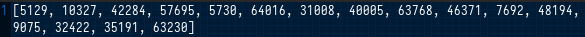

# RSA

## Challenge


## Solution

In this challenge, we have two elements: a python script that performs `RSA` encryption on a message and a list of encrypted values. To decrypt the message, it seems that we need to implement the missing part of the algorithm.


The algorithm:


The encoded values:



The `RSA` decryption algorithm involves calculating the private key exponent, which is the modular inverse of the public key exponent (`e`) with respect to the totient of `n` (`phi`). Once you have the private key exponent, you can decrypt each ciphertext value by raising it to the power of the private key exponent and taking the result modulo `n`.

Here is the the decrypt function in Python:
```python
def decrypt_msg(enc_msg):
    e, n, phi = get_keys()
    d = mod_inverse(e, phi)
    dec_msg = [chr((i ** d) % n) for i in enc_msg]

    return ''.join(dec_msg)
```

And we need to complete the block after the `24th` line:
```python
    elif args.mod == "dec":
        enc_msg = args.text.strip('[]').split(', ')
        enc_msg = [int(i) for i in enc_msg]
        print(decrypt_msg(enc_msg))
```

Now, if we try to run the `peace_of_code.py` like this:
```bash
python3 peace_of_code.py -m dec -t <enc_message>
```


We recover the flag!
