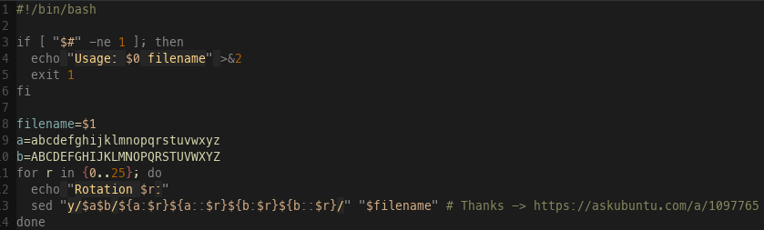

# Capture message

## Challenge

# Solution

The challenge provides us with a text file containing a message that appears to be ciphered with `Cesar code`

We then write a brute-force in `bash` to test the 26 possibilities:

We filter the output with a `grep` to try to get a flag:

Bingo!
