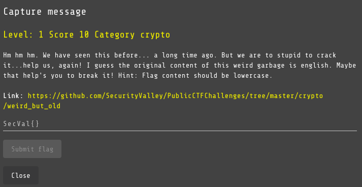
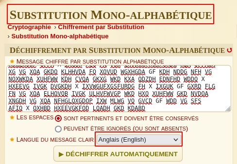
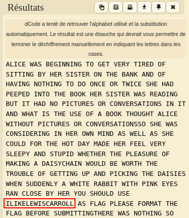

# Capture message 2

## Challenge

## Solution

In this challenge we have another cipher message, with a clue `I guess the original content of this weird garbage is english. Maybe it will help you break it! So we're going to use an online tool `dcode.fr (https://www.dcode.fr/substitution-monoalphabetique)`:

After analysing the results, it is easy to find the flag

