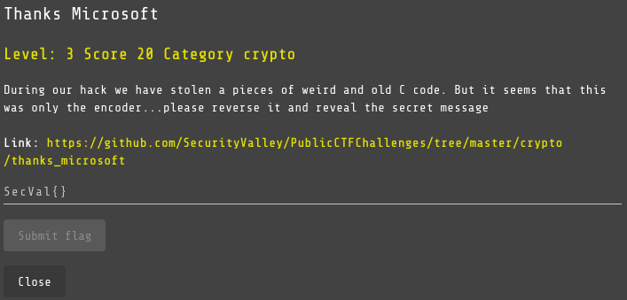
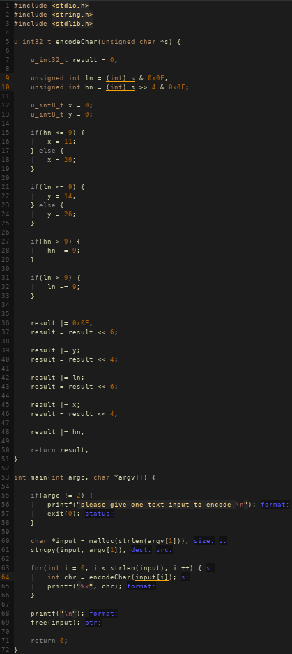
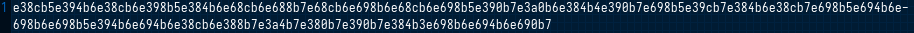
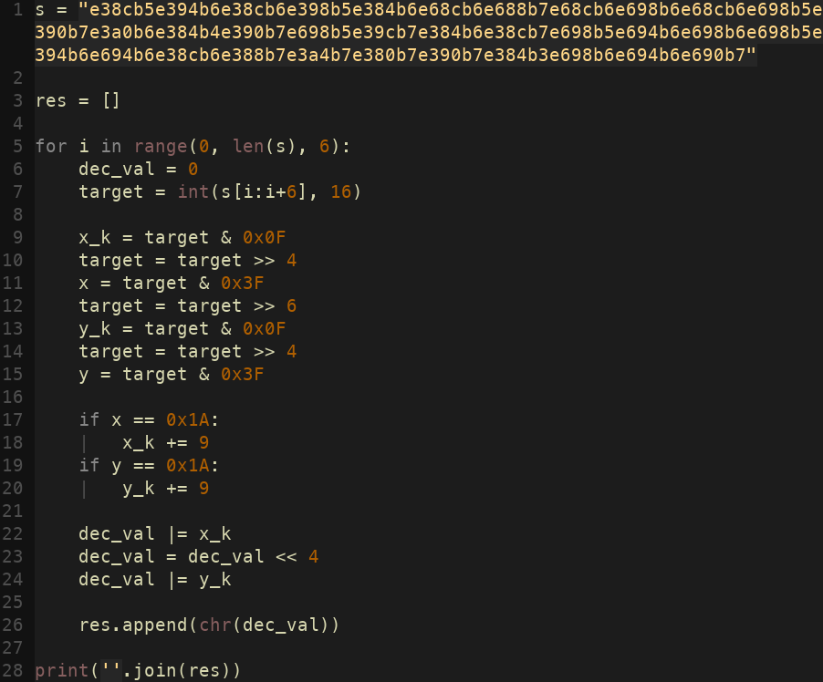
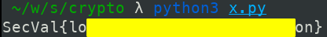

# Thanks Microsoft

## Challenge

## Solution

This challenge gives us two files: a C code `encoder.c` and a text file with an encoded message.

The C code:

The encoded message:

The program takes as input a text provided as an argument and encodes each character. The `encodeChar` function takes a character as input and returns an encoded 32-bit unsigned integer. The main function reads the input text, encodes each character and displays the resulting integer in hexadecimal form. It also checks that the user has supplied exactly one argument on the command line and releases the memory allocated for the input text before terminating.

After writing a program in Python that performs the same actions but in reverse, we find the flag!

Very nice challenge!

