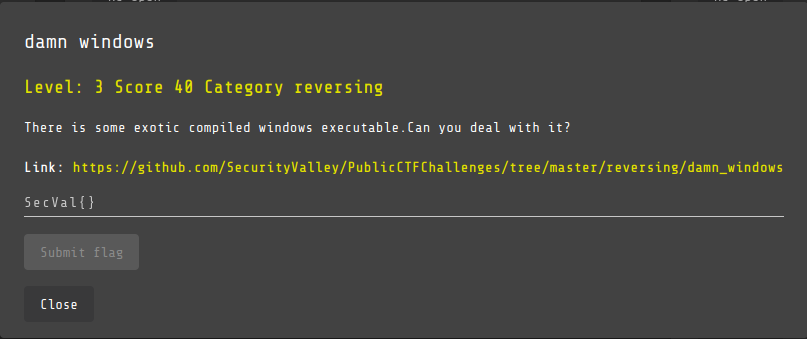
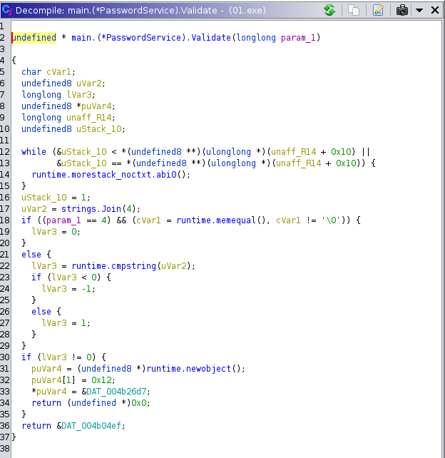
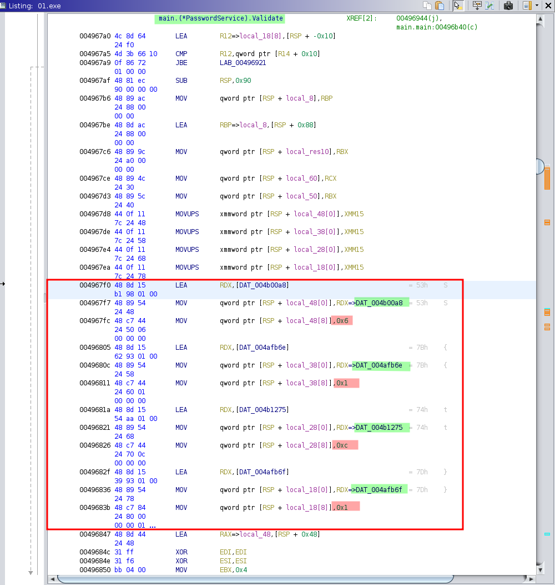
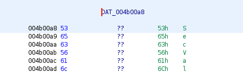

# Damn Windows

## Challenge

## Solution

The challenge gives us a PE32+ file `01.exe` and apparently it is "exotic" compilation. We open it with Ghidra and directly check main.main function:

We understand that the function ask us for a password and read our input. We see a function that seems to compare the password, thus we decide to inspect it to see if we can retrieve the string that is compared to our input:

It's a bit messy we understand that it's doing comparison but cannot see the param which is compared to our input, we check the assembly code to check if we can see more informations:

We clearly see that there is a string loaded in the stack, could it be the string we're looking for ?

