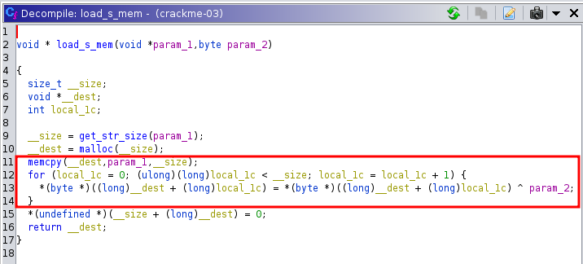

# The Loader

## Challenge


## Solution

We open the given ELF binary (crackme-03) inside Ghidra and directly open main function:


We see a weird parameter `local_18` used in the very sus function `huuu(local_18)` so we decide to dig a bit: 


I wonder what this `load_s_mem()` func does...:



We quickly find out it's doing a xor of our `local_18` parameter from the beginning with `param2` which is `0xfe`.

So all we need to do now is xoring back `local_18` with `0xfe`, we wrote a simple python script to do so:

```python
from pwn import *

var1 = "ad9b9da89f928589caa7a1c9cea196ca8cbaa1b8ceaca1a7ceab83"
res = ""
for i in range(0, len(var1),2):
    res += chr(int("0x"+var1[i:i+2],16)^ord(chr(0xfe)))

print(res)
```
We obtain :

`SecVal{w4Y_70_h4rD_F0R_Y0U}`

Flagged !
